# Acessibilidade no iOS

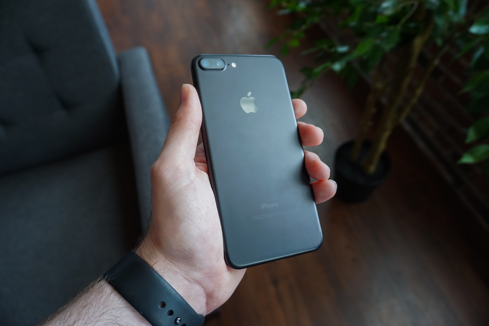

---

## Gabriel Oliva

- 🖥 Engenheiro de software @ CI&T
- 🎵 Batera;
- 🔺 Mineiro que:
	- ☕️ = 😍
	- 🧀 = 😷
- Co-organizador do CocoaHeads BH

<br/><br/><br/><br/>

gfpoliva@gmail.com
@gabrieloliva_


---

## Agenda

- Acessibilidade no iOS
- Importância da Acessibilidade nos apps
- Voice Over
- Demo: implementando acessibilidade em um app

---

## Acessibilidade no iOS


<!--Primeira coisa que vem na cabeça quando você pensa em acessibilidade no iOS?-->

---

# Funcionalidades de acessibilidade no iOS

<!--A apple provê diversas funcionalidades para capacitar pessoas com algum tipo de deficiência a utilizar o OS-->

---

# Apple quebra as funcionalidades em 4 áreas

---

# 👂 ✋ 👁 Aa

---

# Hearing 👂
#### Made for iPhone Hearing Aids

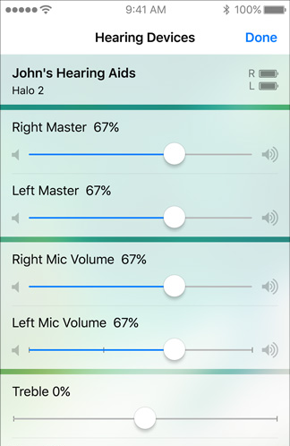

---

# Physical and motor skills ✋
#### AssistiveTouch

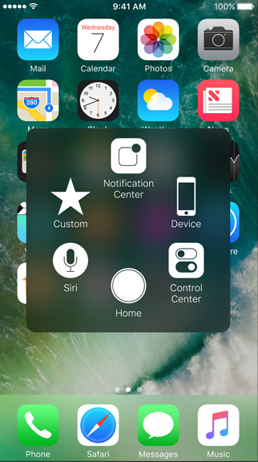

---

# Physical and motor skills ✋
#### Touch Accommodations


---

# Vision 👁 
#### Display Accommodations

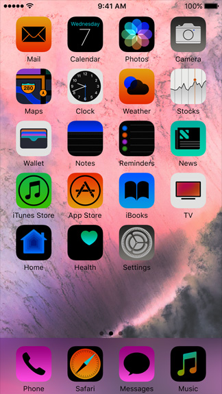

---

# Vision 👁 
#### Zoom

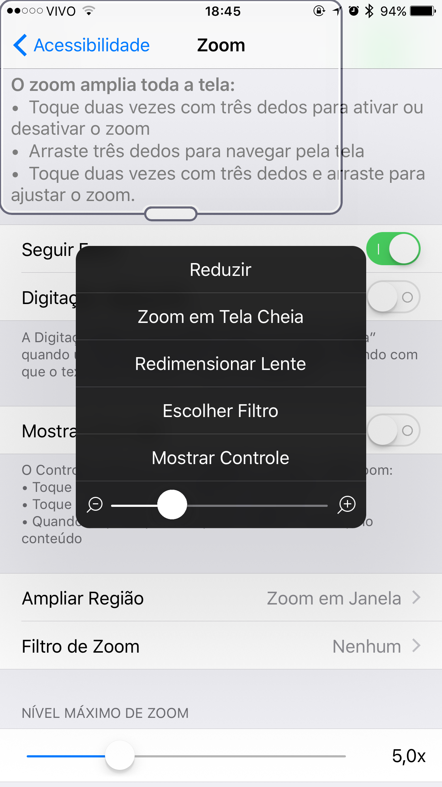

---

# Vision 👁 
#### VoiceOver

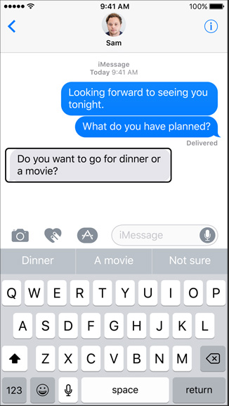

---


# Learning
#### Guided Access

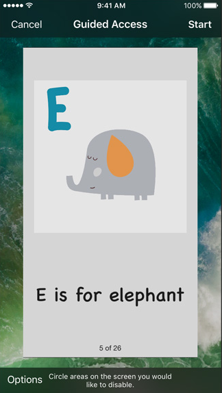

---

# Demo Guided Access

---

# Learning
#### Guided Access

```swift
UIGuidedAccessRestrictionDelegate
```

---

# Por que meu app tem que ser acessível?

---

# 😎 → 🖥

<!--Imagine o seguinte cenário: Uma pessoa com deficiência visual estava trabalhando-->

---

# 🌇

<!--Porém o dia acabou...-->

---
# 😎 → 🏡

<!--... e ela precisava ir para a casa-->

---

# 💡

<!--Então ela tem a brilhante ideia!-->

---

# 😎 → 🚖

<!--VOU DE TAXI-->

---

# 😎 → 📱

<!--Então ela pegou seu iPhone e abriu o app para chamar o taxi...-->

---

# 99 Taxi

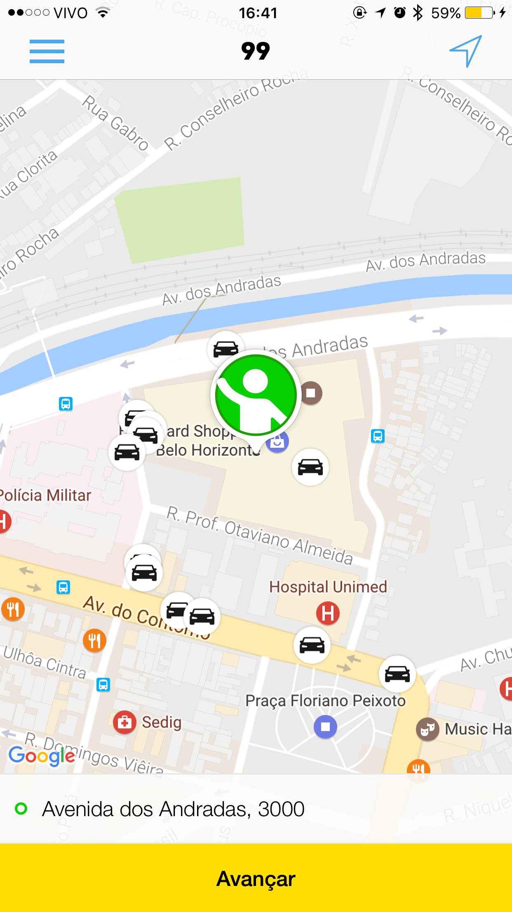

---


<!--TALVEZ pedir para as pessoas fecharem os olhos para tentarem entender o que está acontecendo na tela-->

---

# WTF??!


---

# Por que meu app tem que ser acessível?

<!--Então voltamos a pergunta que fizemos no início: por que meu app tem que ser acessível?-->

---

# Porque pessoas com algum tipo de deficiência poderão utilizar seu app!


<!--Quem aqui trabalho em um projeto como dev iOS?-->
<!--Dos que levantaram a mão, seus projetos são acessíveis?-->

---

# VoiceOver

---

# VoiceOver

##### Uma aplicação é acessível quando todos os elementos são acessíveis

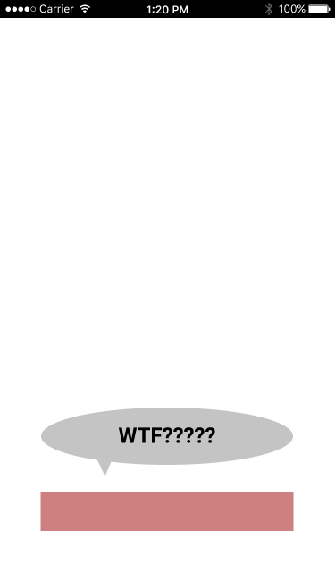

---

# VoiceOver

##### Um elemento é acessível quando ele se autodenomina como um elemento de acessibilidade

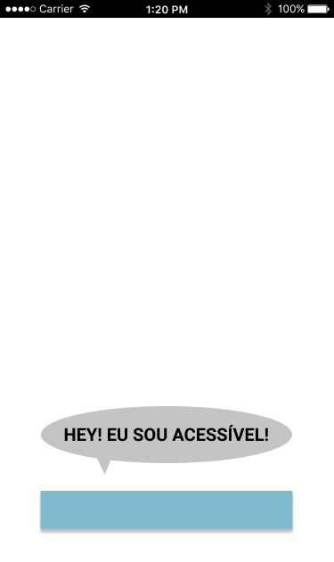

---

# Porém somente se autodenominar como um elemento de acessibilidade não é útil.

---


---

# VoiceOver

##### O elemento deve fornecer informações úteis e precisas para que o VoiceOVer possa interagir com o usuário

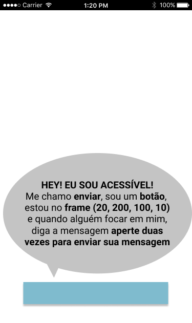

<!--E para isso acontecer, a Apple oferece: -->

---

# Ok, mas como?


---

# VoiceOver
## UIAccessibility

<!--Desde o iOS 3 a Apple disponibiliza o UIAccessibility, uma leve API que ajuda a aplicação a fornecer todas as informações que o VoiceOver necessita para descrever a interface e ajudar pessoas com deficiências visuais a utilizar o app-->

---

# UIKit ♥️ UIAccessibility

<!--O UIAccessibility faz parte do UIKit e é implementado em todos os componentes nativos e views por padrão. Isso significa que quando você usa um componente nativo ou uma view, a maior parte do trabalho já está feita. Dependendo do nível de customização que você precisa na sua aplicação, torná-la totalmente acessível pode ser simples-->

---

# UIKit 💔 UIAccessibility

<!--Mas isso não significa que se você utilizar componentes do UIKit sua aplicação será acessível. Alguns componentes precisam ser customizados para melhorar a usabilidade para usuários. Além disso, existem alguns bugs em alguns componentes ao utilizar a acessibilidade, então é melhor ter cuidado e não confiar na implementação padrão-->

---

# UIAccessibility

### Todos os objetos que implementam o protocolo relatam seus status de acessibilidade quando acessíveis

---

## UIAccessibilityContainer

### Permite que subclasses de UIView torne alguns ou todos os objetos que ele contém acessíveis como elementos separados

---

# UIAccessibilityContainer

```swift
func accessibilityElementCount()
```

```swift
func accessibilityElement(at: Int)
```

```swift
func index(ofAccessibilityElement: Any)
```

```swift
@available(iOS 8.0, *)
var accessibilityElements: [Any]?
```

---

## UIAccessibilityConstants.h

---

# Atributos de acessibilidade

<!--Todos os elementos que são acessíveis e implementam o protocolo UIAccessibility possuem atributos de acessibilidade. Esses atributos vão ajudar o VoiceOver a identificar a interface e dizer informações relevantes para o usuário.-->

---

# Atributos de acessibilidade

Eu sirvo para algum propósito?

```swift
var isAccessibilityElement: Bool
```

---

# Atributos de acessibilidade

Qual meu nome?

```swift
var accessibilityLabel: String?
```

---

# Atributos de acessibilidade

Qual a minha personalidade?

```swift
var accessibilityTraits: UIAccessibilityTraits
```

---


# Atributos de acessibilidade

Qual o meu valor?

```swift
var accessibilityValue: String?
```

---


---

# Atributos de acessibilidade

Como as pessoas deveriam interagir comigo?

```swift
var accessibilityHint: String?
```

---

# Atributos de acessibilidade

Onde eu estou?

```swift
var accessibilityFrame: CGRect
```
<!--O frame do elemento em coordenadas de tela, que é dada pela estrutura CGRect que especifica a localização e o tamanho do elemento na tela.-->

```swift
CGRect UIAccessibilityConvertFrameToScreenCoordinates(CGRect rect, UIView *view);
```

<!--
Caso você queira calcular o frame do elemento em sua coordenada de tela, basta utilizar o método UIAccessibilityConvertFrameToScreenCoordinates passando como parâmetro o elemento e sua superview.-->

---

# Notificações de acessibilidade

<!--Todos os elementos que são acessíveis e implementam o protocolo UIAccessibility possuem dois tipos de notificação de acessibilidade: aquelas que a aplicação pode postar e aquelas que a aplicação pode observar. As notificações observáveis de acessibilidade são postadas pelo UIKit quando algo no ambiente da aplicação muda, como quando alguma configuração de acessibilidade é alternada ou quando o layout é alterado.
-->

---

# Notificações de acessibilidade
### Você consegue postar notificações...

```swift
func UIAccessibilityPostNotification(_ notification: UIAccessibilityNotifications, 
                                     _ argument: Any?)
```

---

# Notificações de acessibilidade
### Você consegue escutar notificações...

```swift
NotificationCenter.default.addObserver(self,
                                       selector: #selector(self.doSomething),
                                       name: NSNotification.Name(rawValue: UIAccessibilityVoiceOverStatusChanged),
                                       object: nil)
```

---

# API simples, ganho enorme...

---

# DEMO

---

# Perguntas?

---

# Links úteis

- Documentação:
	- UIAccessibility API Reference, [Apple](https://developer.apple.com/reference/uikit/uiaccessibility)

- Posts:
	- UIAccessibility, [NSHipster](http://nshipster.com/uiaccessibility/)
	- iOS Accessibility Tutorial: Getting Started, [Ray Wenderlich](https://www.raywenderlich.com/142058/ios-accessibility-tutorial)

---

# Links úteis

- WWDC
	- Auditing Your Apps for Accessibility, [WWDC 2016 - Session 407	- iOS, macOS, tvOS, watchOS](https://developer.apple.com/videos/play/wwdc2016/407/)
	- What's New in Accessibility, [WWDC 2016 - Session 202	- iOS, macOS, tvOS](https://developer.apple.com/videos/play/wwdc2016/202/)

---

# Obrigado 😎