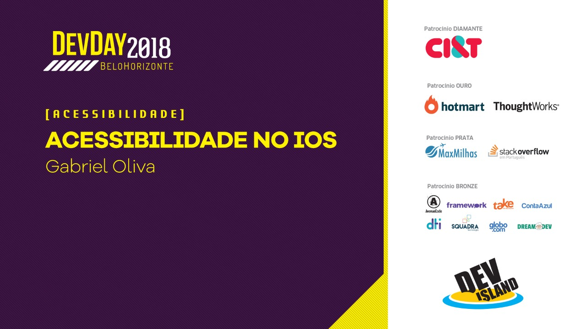

---


- Mobile Developer @ AppProva / SOMOS Educação
- Organizador CocoaHeads BH
- @gabrieloliva_
- linkedin.com/in/gfpoliva/

---

## [fit] Acessibilidade


^ Qual é a primeira coisa que vem na cabeça quando você pensa em acessibilidade?

^ Quando a gente pensa em acessibilidade, pensamos em fazer tecnologia utilizavel para TODOS, independente de suas necessidades.

---
<br/><br/><br/><br/><br/><br/><br/>

# [fit] Mais de 1 bilhão
## [fit] de pessoas possuem algum tipo de deficiências

<br/><br/><br/><br/><br/><br/><br/>
http://who.int/disabilities/en/

^ No mundo, mais de 1 bilhão de pessoas possuem algum tipo de deficiência

---

# [fit] 1 em 7

^ Colocando de outra forma: 1 a cada 7 pessoas possui algum tipo de deficiência. O que significa que você vai ter ou já tem usuários com deficiência utilizando seu app.

---

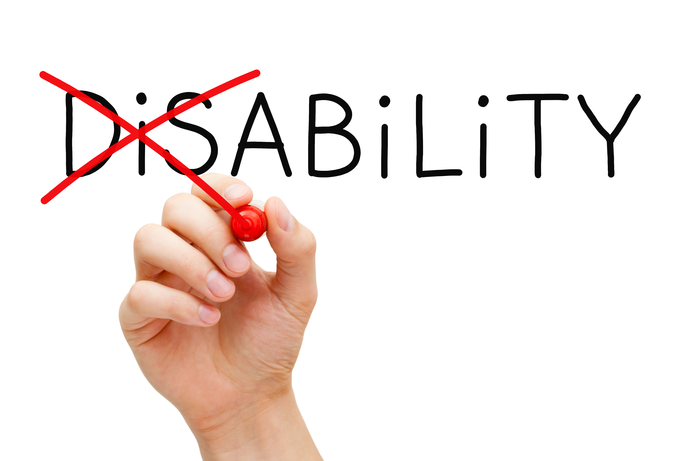

^ Mas no final do dia, acessibilidade não é sobre números. Acessibilidade é a maneira como essas pessoas interagem com o mundo. É sobre o poder transformador da tecnologia, permitindo pessoas utilizarem qualquer tipo de serviço e se incluirem em qualquer sociedade. 
E não há nada mais gratificante que fazer parte desse poder transformador, ajudando essas pessoas.

---

# [fit] Funcionalidades de acessibilidade 
# [fit] no iOS

^ E pra ajudar a a fazer parte desse poder transformador, a apple provê diversas funcionalidades para capacitar pessoas com algum tipo de deficiência a utilizar o sistema.

---

# [fit] 💭 ✋ 👂 👁

^ Ela aborda a acessibilidade em 4 grande áreas: cognitiva, motora, audição e visão.

---

# [fit] Cognitiva 💭

^ Cognitiva encapsula condições como dislexia ou autismo. Ela oferece algumas funcionalides nativas e também uma pequena API para atuar em cima dessa área.

---
Cognitiva
<br/><br/><br/><br/><br/><br/><br/><br/><br/>

# [fit] Guided Access


^ O Guided Access permite que você desabilite funcionalidades como o toque em determinados locais da tela ou gestos, além de poder travar o app. Isso ajuda pessoas com autismo, por exemplo, a poder focar em um objetivo exclusivo

---
# Guided Access
<br/><br/><br/><br/>

```
UIGuidedAccessRestrictionDelegate
```

^ Esse delegate oferece um conjunto de métodos utilizados para adicionar restrições customizadas

---

# [fit] Motora ✋

^ Motora examina as maneiras que o usuário interage fisicamente com o sistema e se eles precisam de acomodações especiais para condições como Parkinson ou Paralisia Cerebral

---
Motora
<br/><br/><br/>

# [fit] Assistive
# [fit] Touch

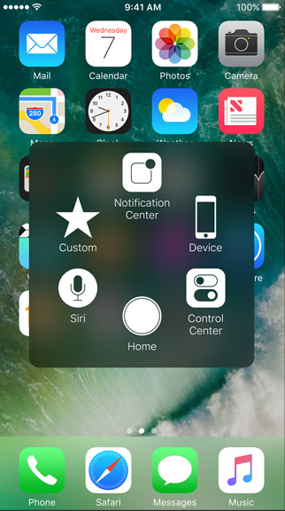

^ Muito utilizado para pessoas com algum tipo de disfunção motora, onde ela não consegue utilizar o home button, fazer um slide down ou up para ver notificações ou control center ou até mesmo usar o switch para colocar o aparelho no silencioso.

---
Motora
<br/><br/><br/><br/><br/>

# [fit] Touch 
# [fit] Accommodations


^ O Touch accommodations cria uma faixa que percorre os eixos horizontais e verticais, percorrendo a tela como uma matriz e deixando o usuário poder selecionar onde ele quiser na tela com apenas um toque.

---

# [fit] Audição 👂

^ Audição encapsula o espectro de pessoas com algum tipo de deficiência auditiva, sendo os que possuem dificuldade de escuta até os que são completamente surdos.

---

Audição
<br/><br/><br/><br/><br/><br/><br/>

# [fit] Made for iPhone
# [fit] Hearing Aids

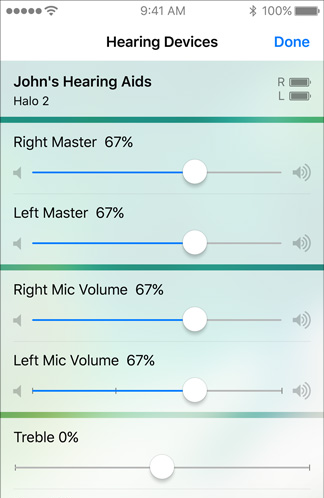

^ Garantir que o software que a Apple faz funciona corretamente com os hardwares

---

# [fit] Visão 👁 

^ Visão engloba o espectro de pessoas com algum tipo de deficiência visual, sendo ele dos que possuem dificuldade de visão até os que são completamente cegos.

---

Vision
<br/><br/><br/><br/>

# [fit] Display 
# [fit] Accommodations

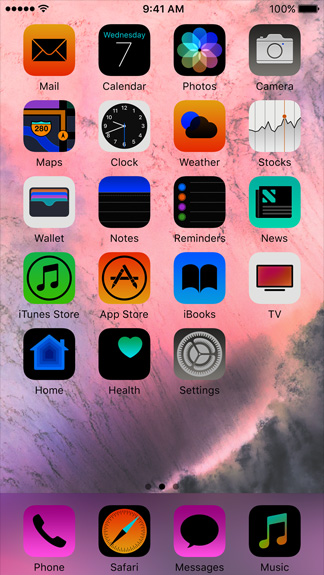

^ Ajuda pessoas com daltonismo ou algum outro tipo de dificuldade visual de cor à aplicar filtros de cores, ajustar a intensidade da cor e até limitar frame rate, fazendo com que a interface fique mais agradável.

---
Vision
<br/><br/><br/><br/><br/>

# [fit] Zoom

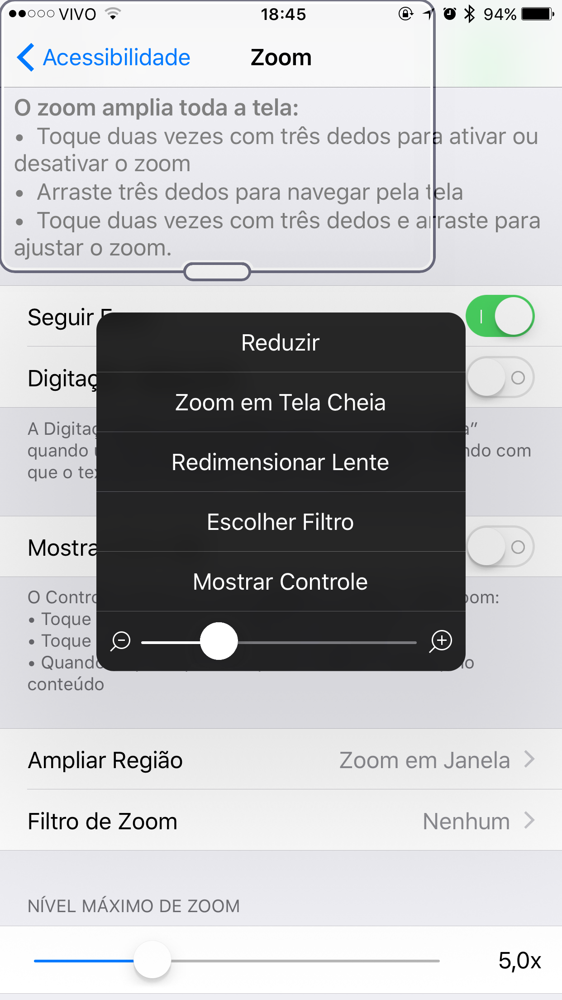

---
Vision
<br/><br/><br/><br/><br/><br/><br/>

# [fit] VoiceOver


^ O VoiceOver é um leitor de tela baseado em gestos que te permite utilizar o iPhone sem ver a tela. Isso é muito util para pessoas que são completamente cegas e a Apple oferece uma API bem extensa para nós adaptarmos nosso app da melhor maneira.

---


^ Além disso, no iOS 11 em diante, a Apple introduziu no VoiceOver a descrição de fotos. Então quando o VoiceOver foca em uma foto, um algoritmo é executado para fazer uma analise básica e tentar descobrir o que a foto contém para dizer os detalhes para o usuário. 
Número de faces, expressões, qual é a cena ao redor e se está focado ou desfocado.

---

# [fit] Caso
# [fit] Real

---

<!--# 😎 → 🖥-->
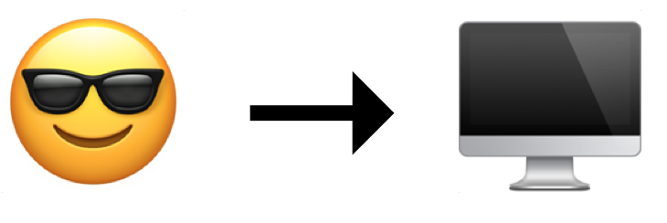

^ Imagine o seguinte cenário: Uma pessoa com deficiência visual estava trabalhando

---

<!--# 🌇-->


^ Porém o dia acabou...

---
<!--# 😎 → 🏡-->
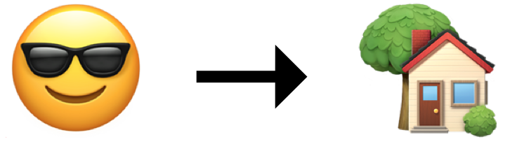

^ ... e ela precisava ir para a casa

---

<!--# 💡-->


^ Então ela tem a brilhante ideia!

---

<!--# 😎 → 🚖-->


^ VOU DE TAXI

---

<!--# 😎 → 📱-->
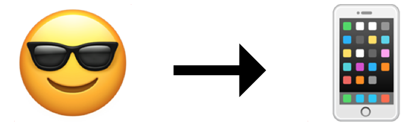

^ Então ela pegou seu iPhone e abriu o app para chamar o taxi...

---


<!--TALVEZ pedir para as pessoas fecharem os olhos para tentarem entender o que está acontecendo na tela-->

---

# WTF??!


---

# [fit] Implementação

---

VoiceOver

<br/><br/><br/><br/><br/><br/><br/>

Um elemento é acessível quando ele se autodenomina como um elemento de acessibilidade

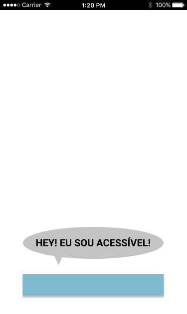

---

### [fit] Porém somente se autodenominar 
### [fit] como um elemento de acessibilidade 
# [fit] não é útil!

---

VoiceOver

<br/><br/><br/><br/><br/><br/><br/>

O elemento deve fornecer informações úteis e precisas para que o VoiceOVer possa interagir com o usuário

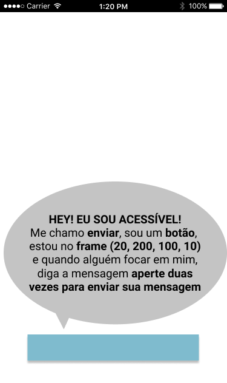

^ Os elementos de interface precisam informar suas propriedades de acessibilidade pois só assim o VoiceOver vai conseguir entregar um conteúdo que o usuário possa entender

---

# [fit] UIKit ❤️ 
# [fit] Accessibilidade

^ Por sorte, o UIKit já implementa a acessibilidade em na maioria dos componentes. A única coisa que precisamos fazer alguns ajustes. Em alguns casos, nem isso.

---

# [fit] UIAccessibility

^ A forma como o UIKit faz isso é já implementando, por padrão, o UIAccessibility, que é um protocolo informal responsável por fornecer informações de acessibilidade dos seus elementos.

---

## Eu sirvo para algum propósito?

``` swift
var isAccessibilityElement: Bool
```

---

## Qual meu nome?

``` swift
var accessibilityLabel: String?
```

---

## Qual a minha personalidade?

``` swift
var accessibilityTraits: UIAccessibilityTraits
```

---


## Qual o meu valor?

``` swift
var accessibilityValue: String?
```

---


---

## Como as pessoas deveriam interagir comigo?

``` swift
var accessibilityHint: String?
```

---

## Onde eu estou?

``` swift
var accessibilityFrame: CGRect
```

---


---

# [fit] Prática

---


---

```swift
func applyAccessibility(_ recipe: Recipe) {
    foodImageView.accessibilityTraits = UIAccessibilityTraitImage
    foodImageView.accessibilityLabel = recipe.photoDescription

    difficultyLabel.isAccessibilityElement = true
    difficultyLabel.accessibilityTraits = UIAccessibilityTraitNone
    difficultyLabel.accessibilityLabel = "Nível de dificuldade"

    switch recipe.difficulty {
    case .unknown:
      difficultyLabel.accessibilityValue = "Desconhecido"
    case .rating(let value):
      difficultyLabel.accessibilityValue = "\(value)"
    }
  }
```

---


---

# [fit] Notificações de acessibilidade

^ os elementos que são acessíveis e implementam o protocolo UIAccessibility possuem dois tipos de notificação de acessibilidade: aquelas que a aplicação pode postar e aquelas que a aplicação pode observar. As notificações observáveis de acessibilidade são postadas pelo UIKit quando algo no ambiente da aplicação muda, como quando alguma configuração de acessibilidade é alternada ou quando o layout é alterado.

---

## Postando notificação

```
func UIAccessibilityPostNotification(_ notification: UIAccessibilityNotifications, 
                                     _ argument: Any?)
```

^ A sua aplicação pode precisar emitir notificações de acessibilidade se algum componente da interface muda frequentemente ou aparece e desaparece. Você pode querar que o foco do VoiceOver va para algum lugar, por exemplo.

---

## Escutando por notificações

```
NotificationCenter.default.addObserver(self,
                                       selector: #selector(self.doSomething),
                                       name: NSNotification.Name.UIAccessibilityVoiceOverStatusDidChange,
                                       object: nil)
```

---

# [fit] Auditando
# [fit] sua aplicação

^ O Xcode 8 trouxe uma nova ferramenta para auditar e ver o comportamente de nossas aplicações em questões de acessibilidade.

---

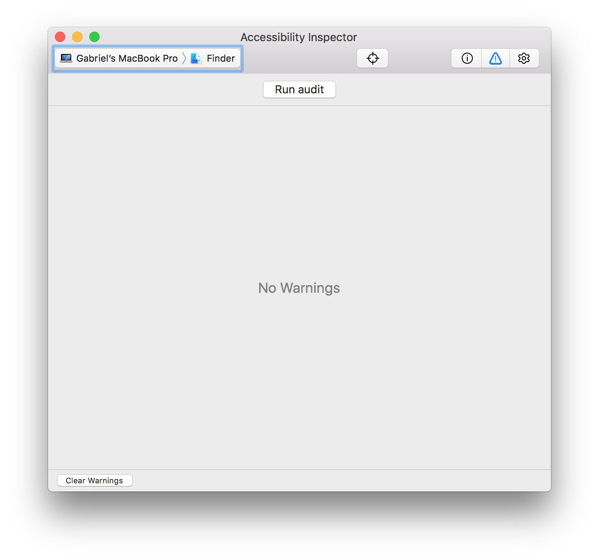

^ O novo Acessibility Inspector

---

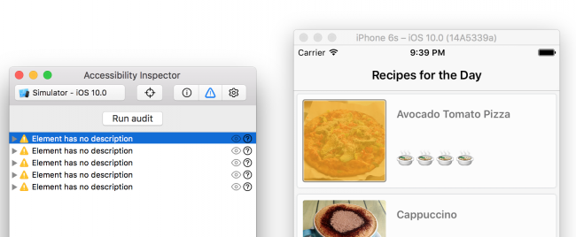
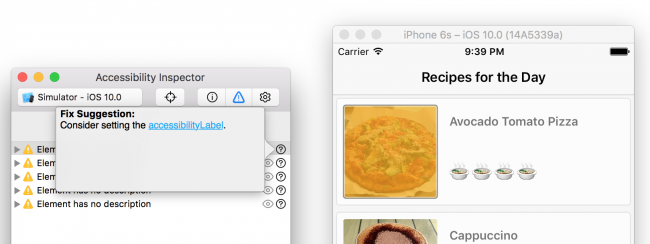

---

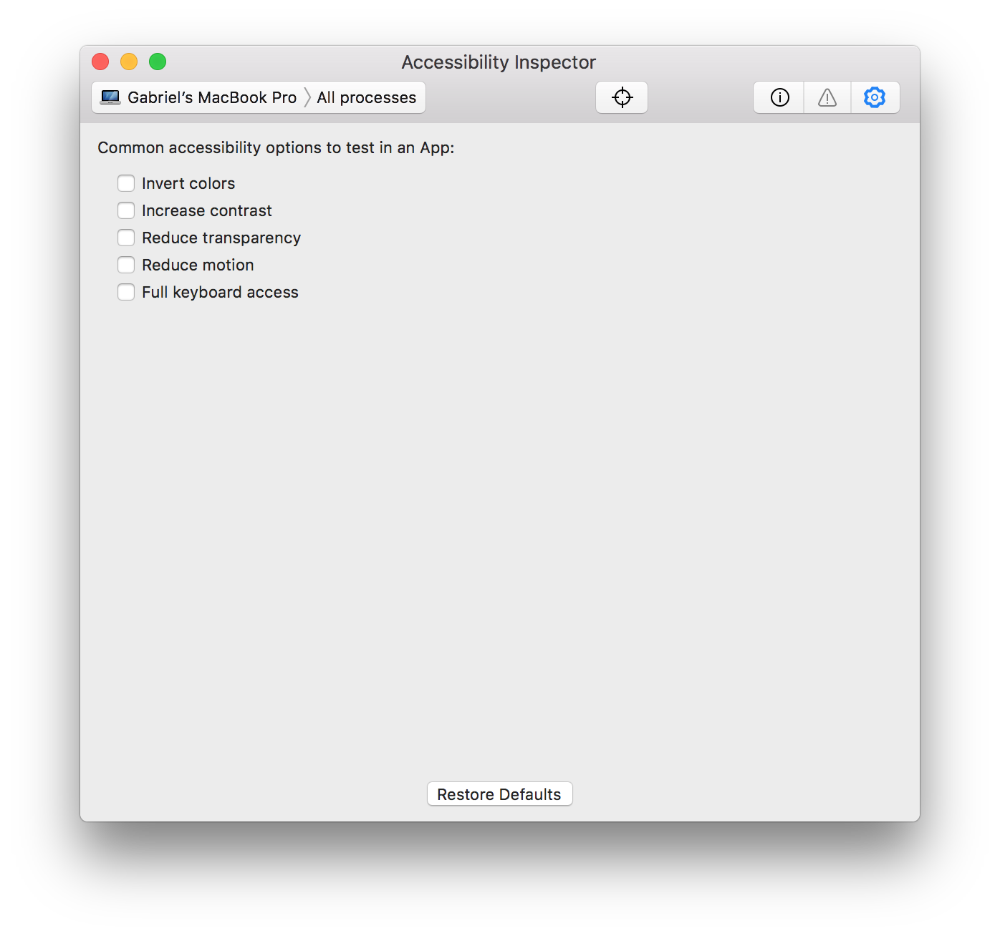

---

# Links úteis

- Auditing Your Apps for Accessibility, [WWDC 2016 - Session 407	- iOS, macOS, tvOS, watchOS](https://developer.apple.com/videos/play/wwdc2016/407/)
- What's New in Accessibility, [WWDC 2016 - Session 202	- iOS, macOS, tvOS](https://developer.apple.com/videos/play/wwdc2016/202/)
- Building Apps with Dynamic Type, [WWDC 2017 - Session 245 - iOS ](https://developer.apple.com/videos/play/wwdc2017/245)

---

# [fit] Obrigado