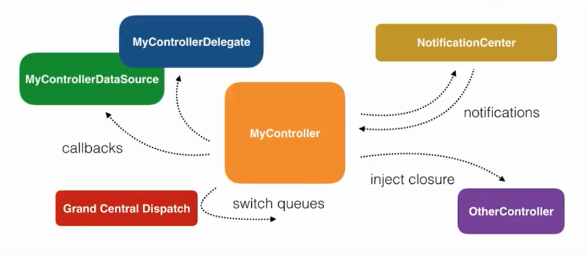
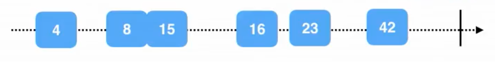
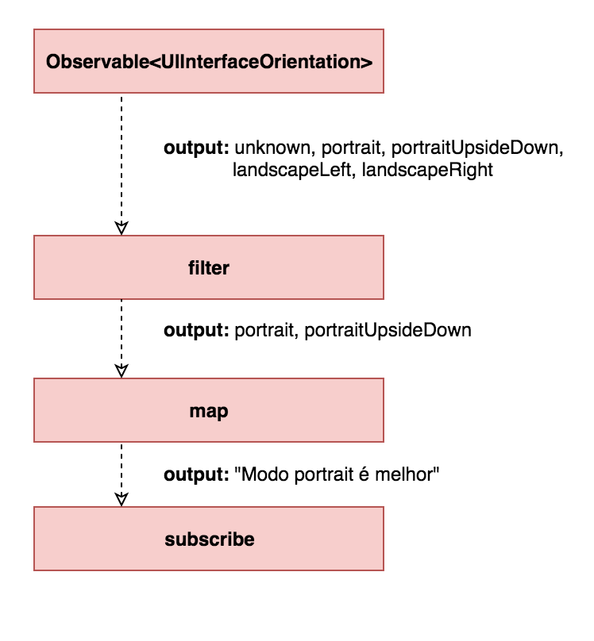

# RxSwift Basics


---

## Gabriel Oliva

- 🖥 iOS Developer @ AppProva
- 🎵 Batera;
- 🔺 Mineiro que:
	- ☕️ = 😍
	- 🧀 = 😷
- Co-organizador do CocoaHeads BH

<br/><br/><br/><br/>

gfpoliva@gmail.com
@gabrieloliva_


---

## Agenda

- Programação Reativa
- Teoria
	- O que é RxSwift?
	- Observables
	- Operadores
	- Efeitos colaterais
- Pratica

---

# Programação Reativa

- Paradigma orientado por:
	-  fluxo de dados
	-  propagação de mudanças

---

# Programação Reativa

Isso significa que é possível expressar fluxo de dados estáticos ou dinâmicos e propagar suas mudanças através de seus subfluxos

---

# O que é RxSwift?

- API multiplataforma chamada Rx
- Extensões Reativas
- Sequencia de eventos
- Composables operators
- Programação assíncrona

---

## Código assíncrono



---

## Observable

A classe Observable representa todas as mudanças dos nossos dados como uma sequencia de eventos ao longo do tempo.  

---

## Observable

Essa sequencia pode ser observada de algum lugar do seu código, então não apenas você tem acesso ao seu dado, mas você tem acesso aos eventos de mudanças do seu dado.

---

## Observable

Você não precisa ser proativo para saber se seu dado foi alterado. O próprio dado te diz quando ele muda e você só precisa reagir à essas mudanças

---

## Observable<Int>




<!-- O que Rx faz, e faz muito bem, é sumir com todos esses padrões e tecnologias e substituir eles por um único padrão: O Observable. A classe Observable representa todas as mudanças dos nossos dados como uma sequencia de eventos ao londo do tempo.  

Essa sequencia pode ser observada de algum lugar do seu código, então não apenas você tem acesso ao seu dado, mas você tem acesso aos eventos de mudanças do seu dado.

Isso da a possibilidade de reagir toda vez que a mudança acontece. Atualizando UI, por exemplo.

O grande lance é que você não precisa ser proativo para saber se seu dado foi alterado. O próprio dado te diz quando ele muda e você só precisa reagir à essas mudanças.

-->

---

## Subjects

Subjects é uma "forma especial" de Observable que podemos nos inscrever e adicionar elementos dinamicamente.


---

## Operadores

```swift
Observable<UIInterfaceOrientation>
```
#### Outputs

```swift
public enum UIInterfaceOrientation : Int {
    case unknown
    case portrait
    case portraitUpsideDown
    case landscapeLeft
    case landscapeRight
}
```

---

## Operadores: filter



---

## Efeitos colaterais

Quando nos inscrevemos à um `Observable`, ele ao longo do tempo vai emitir notificações com os novos valores.

---


---

## Efeitos colaterais

Para reagir à essas mudanças, utilizamos o operador **doOn**.

- **do(onNext:)** - quando você quer fazer algo assim 	que o evento aconteceu.
- **do(onError:)** - quando um erro é emitido.
- **do(onCompleted:)** - se a sequência foi finalizada.

---

## Resumindo

- Tenho um elemento que emite eventos
- Em algum lugar do meu código eu me inscrevo para receber notificações sobre esses eventos
- A partir dessas notificações, eu faço algo

---

# Prática

```swift
let names = Variable([String])
names = ["João", "Maria", "Joana"]
```

---

# Prática

```swift
names.asObservable()
	.subscribe(onNext: { value in
		print(value)
	})
```

<br /><br /><br /><br /><br />
`log: ["João", "Maria", "Joana"]`

---

# Prática

```swift
names.asObservable()
	.map { value in
		return "Participantes CocoaHeads: \(value)"
	}
	.subscribe(onNext: { value in
		print(value)
	})
```

<br /><br /><br /><br /><br />
`log: "Participantes CocoaHeads: ["João", "Maria", "Joana"]"`

---

# Prática

```swift
names.asObservable()
	.throttle(0.5, scheduler: MainScheduler.instance)
	.map { value in
		return "Participantes CocoaHeads: \(value)"
	}
	.subscribe(onNext: { value in
		print(value)
	})
	
names = ["João", "Maria", "Joana"]
names = ["João"]
```

<br /><br /><br /><br /><br />
`log: "Participantes CocoaHeads: ["João"]"`

---

# DEMO

---

# Pra onde ir a partir daqui?

- Networking
- Padrões de delegação
- MVVM

---

# Perguntas?
